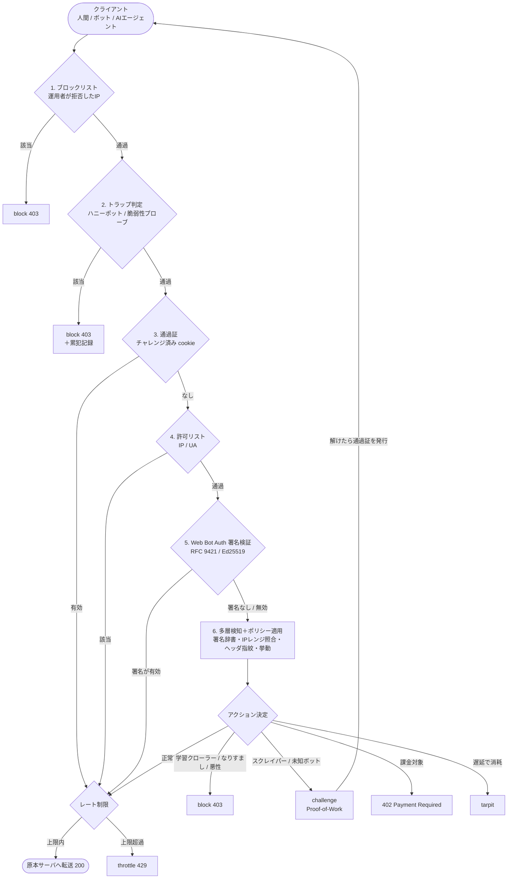
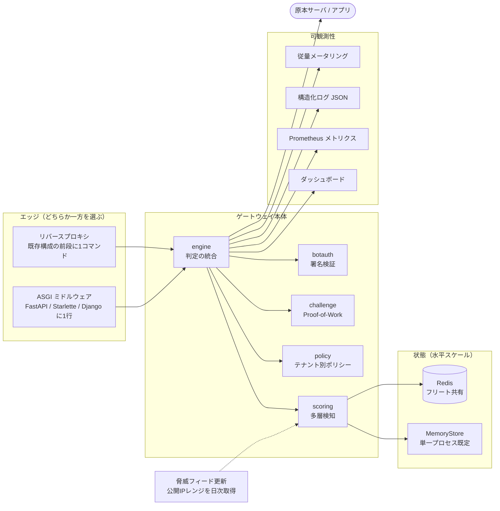
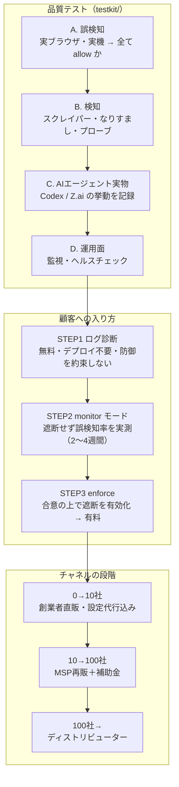

# ToriiGate アーキテクチャ図

ワークフローの全体像。図は GitHub 上でそのまま描画される。
視覚的にまとまった1枚版は、この内容を図解にしたものを別途参照。

---

## 1. 実行時フロー：リクエストが門をくぐる順序

1リクエストごとに上から順に評価し、どこかで振り分けられたらその場で
ゲートウェイが応答する（原本サーバには届かない）。**この順序自体が防御**で、
たとえばチャレンジ通過証を持つ相手でも罠パスは門2で止まる。

> `mode: monitor` の場合、上記のうち allow 以外はすべて `log_only` に置き換わり、
> **遮断せず記録だけ**を行う。本番投入前に必ずこのモードで誤検知を計測する。

## 2. 検知の層と、その限界

| 層 | 何を捕まえるか | 強度 |
|---|---|---|
| ① トラップ | 罠パス・脆弱性探索（robots.txt 無視の証拠） | 決定的 |
| ② 身元 | UA 署名辞書 × 公開IPレンジ照合 → **なりすまし検知** | 強い |
| ③ ヘッダ指紋 | ブラウザを名乗るのに標準ヘッダを欠く（実通信時のみ有効） | 中 |
| ④ 挙動 | 短時間の大量アクセス・累犯IP記憶（Redis でフリート共有） | 中 |
| ⑤ 署名検証 | Web Bot Auth。推測でなく証明。**正規を通し詐称を弾く** | 決定的 |

**正直な限界**：完全なブラウザ偽装＋IPを毎回変える分散スクレイパーは ①〜④ では
**検知率0%**（内部レッドチームで実測）。これは識別情報ベースのボット検知に共通する
原理的限界。重要パスで **⑤ を必須**にすると同じ攻撃が **20/20 遮断**に反転する。
詳細は [security-assessment.md](./security-assessment.md)。

## 3. 構成とデプロイ

環境変数：`TORII_SECRET`（本番必須）、`TORII_REDIS_URL`（複数ワーカー時）、
`TORII_LOG=json`。詳細は [deployment.md](./deployment.md)。

## 4. 品質テストと事業投入の流れ

「守れる」と約束する前に現状を見せる。この順序が誤認販売を防ぎ、
同時に実トラフィックのデータを集める。

テスト手順の詳細は [../testkit/README.md](../testkit/README.md)、
合否記録は [../testkit/CHECKLIST.md](../testkit/CHECKLIST.md)。
事業側の詳細は [gtm-japan.md](./gtm-japan.md)。

## 5. 現在地

**できている**：多層検知エンジン／7種のアクション／Web Bot Auth 署名検証／
2つの導入形態／Docker・Redis 水平スケール／監視・構造化ログ・ヘルスチェック／
脅威フィード自動更新／レッドチーム評価＋独立コード監査（Critical 修正済）／
ログ診断ツール／テストキット／従量メータリング／市場調査・事業計画・GTM・信頼資料。

**まだ無い**：課金の実配線／マルチテナント管理・セルフサーブ／TLS・JA4 指紋と挙動ML／
ISMS・SOC2／負荷試験・第三者ペンテスト／そして最大の空白である
**実トラフィックでの検証**（現在の検知数値はすべて合成トラフィックによる内部実測）。

→ 位置づけは「**資金調達・パイロットに耐えるMVP**」であり
「**販売できる製品**」ではない。残作業は [product-roadmap.md](./product-roadmap.md)。
